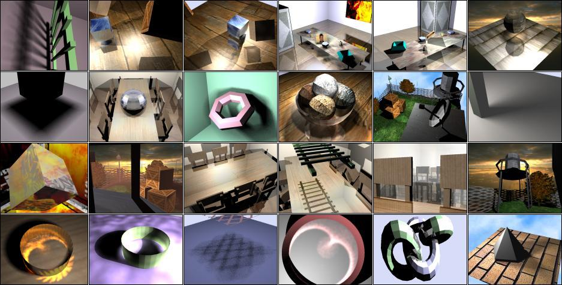



## a 3D Digital Reality Engine V1\.00

### Description

. 3D Digital Reality Engine V1.00, PURE VB, by KACI Lounes

Just if you are an expert 3D programmer, you must NOT miss this submission...

Before I give you one word, PLEASE see the screen-shot !

THIS IS AN EXTEMLY RARE SUBMISSION EVER MADE FOR HIGH LEVEL 3D-GRAPHICS :

1: in VB code, 2: in PURE VB CODE (no DirectX or OpenGL), 3: in the PSC

This is the first publication release on the Internet...

more modifications and additions will comes in the future versions...

The source code is written in a very careful way so everybody can understand

how the things works. your questions, and suggestions are VERY important

to me, of course...just don't forgot to give me some votes !

Be only PATIENT during the download operation, because the archive

include also the documentation &amp; some samples of 3D scenes.

KACI Lounes

EOF.
 
### More Info
 

             |
---                |---
**Submitted On**   |2009-02-09 12:53:22
**By**             |[KACI      Lounes](https://github.com/Planet-Source-Code/PSCIndex/blob/master/ByAuthor/kaci-lounes.md)
**Level**          |Advanced
**User Rating**    |5.0 (115 globes from 23 users)
**Compatibility**  |VB 4\.0 \(32\-bit\), VB 5\.0, VB 6\.0
**Category**       |[Graphics](https://github.com/Planet-Source-Code/PSCIndex/blob/master/ByCategory/graphics__1-46.md)
**World**          |[Visual Basic](https://github.com/Planet-Source-Code/PSCIndex/blob/master/ByWorld/visual-basic.md)
**Archive File**   |[a\_3D\_Digit2150294212009\.zip](https://github.com/Planet-Source-Code/kaci-lounes-a-3d-digital-reality-engine-v1-00__1-72016/archive/master.zip)

